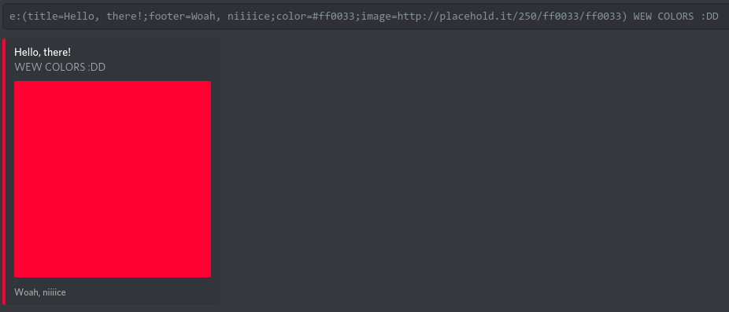

# embedz
> A simple Discord bot requested by Sasuke#0196 that does nothing other than allow you to embed.



- [Options](#options)
- [Installation](#installation)
- [Usage](#usage)

## Options
**Note:** You can set defaults for all of these in `config.json`.

Option | Type | Description
------ | ---- | -----------
`color` | Color | The color of the embed.
`title` | Text | The title of the embed.
`url` | URL | The URL of the embed.
`author` | Text | The name of the author.
`authorIcon` | URL | The icon of the author.
`footer` | Text | The footer text.
`footerIcon` | URL | The icon to use for the footer.
`image` | URL | The URL of the image to use.
`thumbnail` | URL | The URL of the thumbnail to use.

## Installation
First, run the following commands:
```bash
git clone https://github.com/Rayzr522/embedz.git
cd embedz
yarn install
```

Then duplicate `config.json.example` and rename it to `config.json`, filling in all the required fields.

## Usage
```bash
cd path/to/embedz
yarn start
```

###### [Come chat with some cool peepz ;)](https://discord.io/rayzrdevofficial)